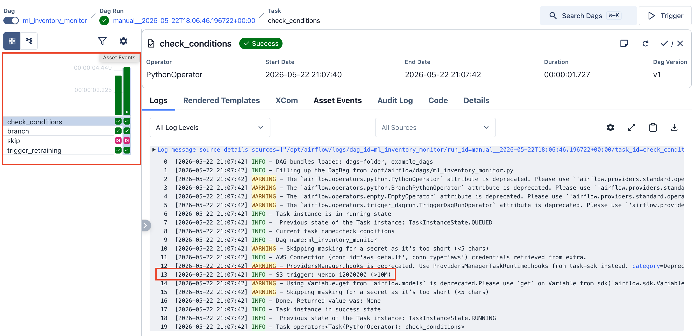
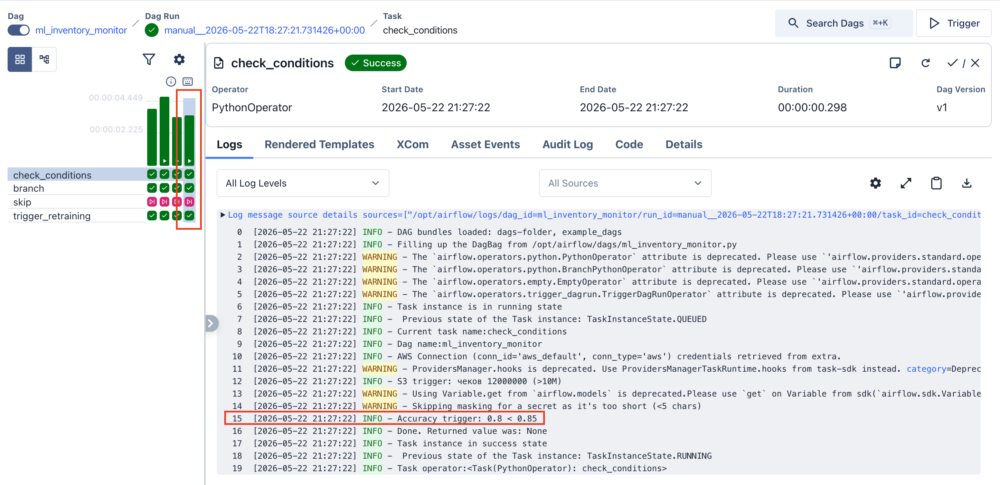
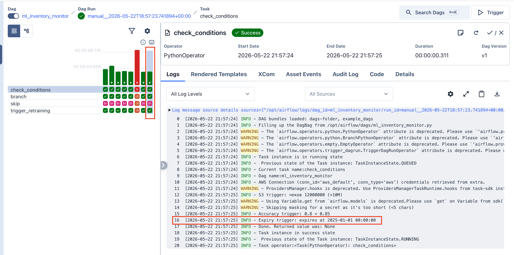

# Домашнее задание №9: MLOps – от пайплайна до управления рисками

Репозиторий содержит решение домашнего задания по построению ML-системы для интернет-магазина «Книжный Мир» и других кейсов.  
Реализованы: батчевый ML-конвейер, автоматическое переобучение по триггерам, IaC с Terraform, мониторинг SLI/SLO и статистически обоснованное принятие решений.

[Ноутбук](HW9_Design_Смирнова_Анастасия.ipynb)

## Структура репозитория
```text
├── .github/workflows/ci-cd.yaml # CI/CD пайплайн (GitHub Actions)
├── dags/ # DAG'и Airflow
│ ├── ml_inventory_monitor.py # Мониторинг условий и запуск обучения
│ ├── ml_inventory_retraining_pipeline.py# Пайплайн обучения модели
│ └── init.py
├── tests/
│ └── test_monitor.py # Юнит-тест проверки условий
├── main.tf # Terraform: описание ресурсов (S3-бакеты)
├── variables.tf # Terraform: переменные
├── outputs.tf # Terraform: выходные данные
├── requirements.txt # Python-зависимости для CI/CD
├── Dockerfile # Кастомный образ Airflow с провайдерами
├── docker-compose.yaml # Локальное окружение Airflow
├── docker-compose.override.yaml # Добавляет moto (эмулятор S3)
├── generate_synthetic_data.py # Генератор синтетических чеков для S3
├── img/ # Скриншоты для отчёта
│ ├── trigger_ten_million_checks.png
│ ├── trigger_acc.png
│ └── time_trigger.png
└── README.md # Этот файл
```

## Задание 1. Выбор архитектуры ML-конвейера

### Вопрос 1
Ответ: Батч-архитектура с обучением по расписанию
Обоснование: Наиболее оптимальная архитектура для данной задачи - батчевая. Потоковая и онлайн архитектуры слишком избыточно и создадут дополнительную нагрузку, поскольку подразумевают частые обновления, чего не требуется в данной задаче. Гибридная архитектура допустима, но также является избыточной, поскольку в нашей задаче не требуется многновенных обновлений. Переобучение модели лучше запускать по расписанию, поскольку требуется обновление раз в сутки. Для этого отлично подойдут CRON задачи. Обновление по появлению новых данных избыточно, так как при появлении каждого нового батча, будет генерироваться нагрузка на систему. Остальные два варианта также не удовлетворяют требованию "ежедневное обновление"

### Вопрос 2
Ответ: Потоковая архитектура с запуском переобучения при появлении новых данных
Обоснование: Поскольку критически важно обновление и предсказания в реальном времени, наиболее оптимальным варинатом будет потоковая архитектура. Остальные типы архитектуры не смогут обеспечить нужной оперативности. Обновление необходимо запускать по появлению новых данных, чтобы модель всегда имела представление о наиболее свежих данных.

### Вопрос 3
Ответ: Гибридная архитектура в сочетании с переобучением по алерту мониторинга
Обоснование: Для данной задачи лучше всего подойдет гибридная архитектура с запуском переобучения по алерту мониторинга (например, при обнаружении data drift или concept дрифт). Такой подход позволит моментально учесть изменения в поведении пользователей в сочетании с предсказаниями на больших объемах данных.

### Вопрос 4
Ответ: Онлайн-обучение с обновлением при появлении новых данных
Обоснование: Поскольку для данной задачи важна постоянная адаптация к меняющимся условиям больше всего подойдет онлайн-обучение в сочетании с обновлением по появлению новых данных. Это напрямую соответствует необходимости инкрементального обновления.

## Задание 2. DAG Airflow и Continuous Training

Разработаны два DAG'а:

- **`ml_inventory_monitor`** – запускается каждый час и проверяет три условия:
  1. Суммарно по всем кассам накопилось >10 млн чеков (файл на S3).
  2. Точность модели (accuracy) упала ниже 0.85.
  3. Срок жизни модели истекает менее чем через час.
  При выполнении любого условия автоматически запускает пайплайн обучения.
- **`ml_inventory_retraining_pipeline`** – обучает модель (линейную регрессию), оценивает качество и деплоит её.

Оба DAG'а протестированы локально с эмулятором S3 (moto) и синтетическими данными.  
  
  


## Задание 3. Инфраструктура как код (IaC) и CI/CD

### Terraform
Конфигурация Terraform описывает два S3-бакета (`retail-checks-*` и `ml-model-registry-*`) и IAM-пользователя с политиками доступа.  
Для локальной демонстрации используется эмулятор MinIO.  
В коде предусмотрена полная деинсталляция (`terraform destroy`) после завершения работы – инфраструктура не является статичной.

### CI/CD (GitHub Actions)
Пайплайн `.github/workflows/ci-cd.yaml` состоит из трёх джоб:

1. **lint-and-test** – проверка синтаксиса DAG и юнит-тесты.
2. **terraform-check** – валидация Terraform-конфигурации.
3. **infrastructure-demo** – полный цикл:  
   - запуск MinIO,  
   - `terraform plan` и `apply` (создание бакетов),  
   - проверка созданных бакетов,  
   - `terraform destroy` (гарантированное удаление).

Все джобы отрабатывают при каждом пуше в `main`.  
**Результат последнего запуска:** [ML CI/CD](https://github.com/steishas/hw-9-mlops-mipt-smirnova-anastasia/actions/runs/26330786768)

## Задание 4. Управление рисками (SLI/SLO)

Определены ключевые индикаторы на трёх уровнях:

| Уровень | SLI | SLO | Реакция при нарушении |
|--------|-----|-----|------------------------|
| **Бизнес** | Доля заказов с задержкой >24 ч по причине нехватки товара | <= 5% в месяц | Внеплановая проверка модели и складской политики |
| **Модель/данные** | MAPE прогноза списания (7-дневное окно) | <= 15% (warning 15–20%, critical >20%) | Автоуведомление ML-инженера, при critical – переобучение |
| | PSI ключевых признаков (средний чек, частота покупок) | <= 0.2 | Алерт, дашборд Evidently |
| | Время от появления данных до переобучения | <= 25 ч (critical >30 ч) | Эскалация на инженера |
| **Инфраструктура** | Доступность S3 (успешные запросы) | >= 99.9% в месяц | Критический алерт |
| | Доля успешных запусков DAG | 100% (допустим 1 сбой в месяц) | Вмешательство при двух подряд отказах |

Алерты отправляются на e-mail ответственной команде.

## Задание 5. Metrics Driven Development и ADR

Выбрана бизнес-метрика «доля задержек по причине нехватки товара».  
Сгенерированы две выборки:
- историческая: 1000 заказов, 5% задержек;
- новая: 500 заказов, 7% задержек.

Проведён односторонний z-тест пропорций.  
**Результат:** p-value = 0.057 > 0.05, 95% доверительный интервал разности [–0.006, 0.046] включает 0.  
**Решение:** статистически значимое ухудшение не обнаружено, внеплановое переобучение не требуется. Продолжаем мониторинг.

Принятое решение задокументировано в формате [Architecture Decision Record (ADR)](docs/adr-001.md)
